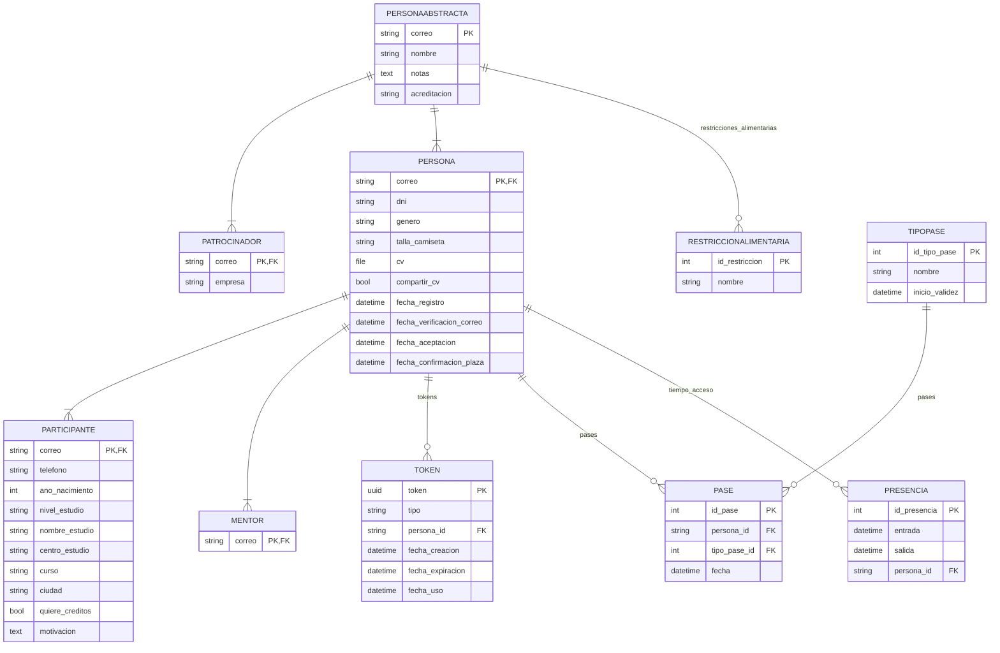

# Hackackathon

Un proyecto hecho con Django para la gestión de hackackatones.

# Instrucciones para desarrollo

Después de clonar el repositorio, sigue estos pasos para iniciar el desarrollo:

1. Definir variables de entorno.\
   Renombra `template.env` a `.env` y fija los valores de las variables.
2. Crear el entorno virtual de Python e instalar las dependencias.
3. Crear la base de datos con las migraciones existentes:\
   `python manage.py migrate`
4. Cargar la tabla de restricciones alimentarias:\
   `python manage.py loadddata restriccion_alimentaria`
5. (Opcional) Generar Participantes de ejemplo:\
   `python manage.py fakekeuserdata <cantidad>`

# Diagrama Entidad-Relación de los modelos empleados

## Licencia

El proyecto está bajo la licencia AGPLv3, para más info ver [la licencia](LICENSE).
